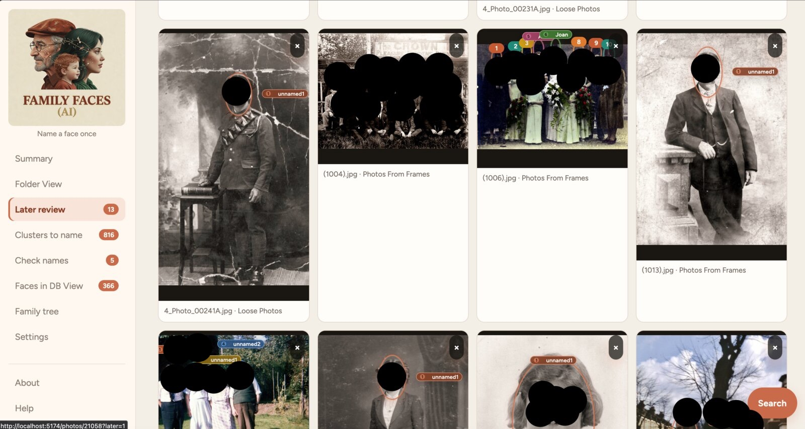

# Family Faces

A local app for a family photo library. It finds faces, groups people
who look the same, and lets you **name someone once** — then matches
the rest. Original photos are never moved or rewritten so this can work
with .jpg, .gif, .heic, .raw or any filetype as the metadata describes
the people tagged in each folder.

The same person at 3 and 75 will usually be two groups. Merge them when
you know they are the same person.

This software was written to help me identify who-is-who from a collection
of 30,000 photos and has sped up that process.

Face matching uses InsightFace (buffalo_l / ArcFace) on ONNX Runtime,
with AdaFace as a second pass when a match is unsure.

This has been enhanced by identifying statues with faces and similar
objects which are kept out of those matches by colour/material checks
and ArcFace similarity to heads already marked as junk — not by AdaFace.



## Features

**Name faces**
- Import folders from this Mac or a NAS; later runs only look at new
  photos
- Find every face in a photo, including group shots
- Name a whole group of lookalikes in one go
- Match remaining faces to people you have already named
- Review names the app applied on its own

**Browse the library**
- Albums, or view by person or by tag
- Search by name, nickname, birth surname, or a snapshot
- Record a birth surname alongside the married full name
- Keyboard shortcuts for reviewing photos
- Slideshow, name labels on the picture, download with or without labels

**People and family**
- People catalog — merge childhood and later-life photos, add
  nicknames
- Family tree from a GEDCOM file
- Dashboard of people named, faces recognised, and groups still to name

**Originals stay put**
- Photos are never moved, renamed, or rewritten
- Names live in the app; a copied folder keeps its labels
- Close any time and continue tagging later

## Run

Needs Python 3.12 and Node 20+.

```bash
python3.12 -m venv .venv
.venv/bin/pip install -r backend/requirements.txt
cd frontend && npm install && cd ..
chmod +x scripts/app.sh scripts/dev.sh
./scripts/app.sh start
```

Open http://127.0.0.1:5174

On Windows see [README.windows.md](README.windows.md); `scripts/app.cmd` and
`scripts/app.py` do what `app.sh` does there.

```bash
./scripts/app.sh stop
./scripts/app.sh status
./scripts/app.sh logs --follow
```

Click **Choose folders**, pick a folder or a NAS share (mount it in
Finder first), then **Find Known Faces**. The first scan downloads the
face models (~300MB).

## Using it

1. Index a folder.
2. Open **Clusters to name**, largest first, and type a name.
3. On **People**, merge childhood / adult / elder cards when they are
   the same person.
4. Sweep leftovers in **Photos** (filter “unnamed”). Keys: `1–5`
   assign a suggestion, `n` new person, `u` unassign, `j`/`k` next
   face, arrows next photo.

Child and adult photos of the same person are not matched automatically.
That is a model limit, not a missing feature.

## Stack

- **UI** — React, React Router, Vite
- **API** — FastAPI, uvicorn, python-multipart
- **Faces** — [InsightFace](https://github.com/deepinsight/insightface)
  (`buffalo_l` / ArcFace) on ONNX Runtime, with
  [AdaFace](https://github.com/mk-minchul/AdaFace) as a second pass when
  a match is unsure
- **Photos** — Pillow, pillow-heif, rawpy, OpenCV, NumPy
- **Tests** — pytest, httpx

## Privacy

Keep personal names, photo paths, family trees, and face crops out of
git. They belong in `data/` (ignored) or in the album folders on disk.
Tests and UI copy use fictional names only.
